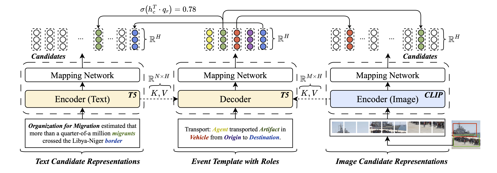

# MMUTF: Multimodal Multimedia Event Argument Extraction with Unified Template Filling

- [Overview](#overview)
- [Requirements](#requirements)
- [Data](#data)
- [Quickstart](#quickstart)
- [Citation](#citation)

## Overview



## Requirements

You can install the necessary modules in your environment using `requirements.txt`. We use weights & biases (wandb) to track the experiment details. You may use an existing wandb-account or must replace the wandb logging in the source code with your own logger.

```python
pip install -r requirements.txt
```

## Data

**ACE:** Textual event extraction data for training can be downloaded at [ACE2005](). We follow the preprocessing format of [TextEE]() and use the train and development split for training and test split for validation. The sample format is shown in `examples/text_sample.json`. Note that the ACE2005 dataset is only accessible with the respective LDC license.

**SWiG:** Visual event extraction data for training can be downloaded at [SWiG](). We use the train and development split for training and test split for validation. Therefore, you simply can combine the `train.json` and `dev.json` files. For training, we use a simple data augmentation pipeline based on the module `albumentations`.

**M2E2:** Multimedia event extraction data for testing can be downloaded at [M2E2](). We provide the YOLOv8 object detections in `data/objects/m2e2.pkl` but you can use your own object detection results following the `utils/objects/detection.py` script. For fair comparison, we additionally provide the event detection results in `data/triggers`. Prepare the M2E2 benchmark into the correct format with `utils/m2e2/prepare.py`.

## Quickstart

Train and test your own model using the `mmutf.py` script. To reproduce the results of our work, simply run `mmutf.sh`, which includes all necessary parameters. For testing only, remove `--do_train` and add the `--do_test` flag along with the `--checkpoint` path to your best model weights. 

```bash
# Run YOLOv8 object predictions
bash utils/prepare_objects.sh

# Run M2E2 format preparations
bash utils/prepare_m2e2.sh

# Train and test MMUTF
bash mmutf.sh
```

**Note:** You may need to adjust file paths to match your setup.

## Citation

If you find our work helpful, please consider citing our official publication:

```bibtex
@inproceedings{seeberger2024mmutf,
    title={MMUTF: Multimodal Multimedia Event Argument Extraction with Unified Template Filling},
    author={Philipp Seeberger and Dominik Wagner and Korbinian Riedhammer},
    booktitle={Findings of the Association for Computational Linguistics: EMNLP 2024},
    year={2024}
}
```